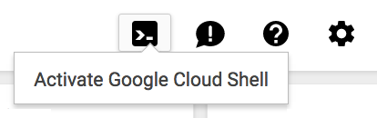
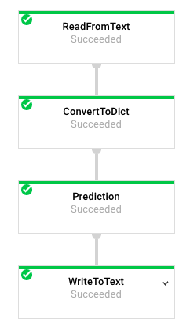
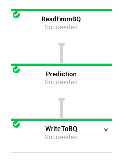

# Cloud Dataflow Batch ML Predictions Example

Disclaimer: This is not an official Google product.

This is an example to demonstrate how to use Cloud Dataflow to run batch
 processing for machine learning predictions. The machine learning model is
 trained with TensorFlow, and the trained model is exported into a Cloud
 Storage bucket in advance. The model is dynamically restored on the worker
 nodes of prediction jobs. This enables you to make predictions against a
 large dataset stored in a Cloud Storage bucket or BigQuery tables, in a
 scalable manner, because Cloud Dataflow automatically distribute the
 prediction tasks to multiple worker nodes.

## Products
- [Cloud Dataflow][1]
- [TensorFlow][2]

[1]: https://cloud.google.com/dataflow/
[2]: https://www.tensorflow.org/

## Prerequisites
1. A Google Cloud Platform Account
2. [A new Google Cloud Platform Project][3] for this lab with billing enabled
3. Enable the Cloud Dataflow API from [the API Manager][4]

[3]: https://console.developers.google.com/project
[4]: https://console.developers.google.com

## Do this first
In this section you will start your [Google Cloud Shell][5] and clone the
 application code repository to it.

1. [Open the Cloud Console][6]

2. Click the Google Cloud Shell icon in the top-right and wait for your shell
 to open:

 

3. Install Cloud Dataflow SDK:

  ```
  $ pip install google-cloud-dataflow --user
  ```

4. Install TensorFlow:

  ```
  $ pip install tensorflow --user
  ```

5. Clone the lab repository in your cloud shell, then `cd` into that dir:

  ```
  $ git clone https://github.com/GoogleCloudPlatform/dataflow-prediction-example
  Cloning into 'dataflow-prediction-example'...
  ...

  $ cd dataflow-prediction-example
  ```

[5]: https://cloud.google.com/cloud-shell/docs/
[6]: https://console.cloud.google.com/

5. Create a storage bucket and upload work files:

  ```
  $ PROJECT=$(gcloud config list project --format "value(core.project)")
  $ BUCKET=gs://$PROJECT-dataflow
  $ gsutil mkdir $BUCKET
  $ gsutil cp data/export* $BUCKET/model/
  $ gzip -kdf data/images.txt.gz
  $ gsutil cp data/images.txt $BUCKET/input/
  ```

## Make predictions using Cloud Storage as a data source

1. Submit a prediction job.

  ```
  $ python prediction/run.py \
      --runner DataflowRunner \
      --project $PROJECT \
      --staging_location $BUCKET/staging \
      --temp_location $BUCKET/temp \
      --job_name $PROJECT-prediction-cs \
      --setup_file prediction/setup.py \
      --model $BUCKET/model \
      --source cs \
      --input $BUCKET/input/images.txt \
      --output $BUCKET/output/predict
  ```

  The flag `--source cs` indicates that the prediction data source
  and prediction results are stored in the Cloud Storage bucket.
  The number of worker nodes is automatically adjusted by the autoscaling
  feature. You can specify the number of nodes by using the `--num_workers`
  parameter, if you want to use a fixed number of nodes.

  By clicking on the Cloud Dataflow menu on the Cloud Console, you find
  the running job and the link navigates to the data flow graph as below:

 

2. Confirm the prediction results.

  When the job finishes successfully, the prediction results are stored
  in the Cloud Storage bucket.

  ```
  $ gsutil ls $BUCKET/output/predict*
  gs://[PROJECT_ID]-dataflow/output/predict-00000-of-00003
  gs://[PROJECT_ID]-dataflow/output/predict-00001-of-00003
  gs://[PROJECT_ID]-dataflow/output/predict-00002-of-00003
  ```

## Make predictions using BigQuery as a data source

1. create a BigQuery table and upload the prediction data source.

  ```
  $ bq mk mnist
  $ bq load --source_format=CSV -F":" mnist.images data/images.txt.gz \
      "key:integer,image:string"
  ```

2. Submit a prediction job.

  ```
  $ python prediction/run.py \
      --runner DataflowRunner \
      --project $PROJECT \
      --staging_location $BUCKET/staging \
      --temp_location $BUCKET/temp \
      --job_name $PROJECT-prediction-bq \
      --setup_file prediction/setup.py \
      --model $BUCKET/model \
      --source bq \
      --input $PROJECT:mnist.images \
      --output $PROJECT:mnist.predict
  ```

  The flag `--source bq` indicates that the prediction data source
  and prediction results are stored in BigQuery tables.

  By clicking on the Cloud Dataflow menu on the Cloud Console, you find
  the running job and the link navigates to the data flow graph as below:

 

3. Confirm the prediction results.

  When the job finishes successfully, the prediction results are stored in
  the BigQuery table. By clicking on the BigQuery menu on the Cloud Console,
  you find the `mnist.predict` table which holds the prediction results.

  For example, you can see the prediction results for the first 10 images,
  in a tabular format, by executing the following query.

  ```
  SELECT * FROM mnist.predict WHERE key < 10 ORDER BY key;
  ```

## Cleaning up
Clean up is really easy, but also super important: if you don't follow these
 instructions, you will continue to be billed for the project you created.

To clean up, navigate to the [Google Developers Console Project List][5],
 choose the project you created for this lab, and delete it. That's it.

[5]: https://console.developers.google.com/project

## Related solutions
- [TensorFlow Serving][6] is an open-source software library for serving machine
 learning models.
- [Google Cloud Machine Learning][7] is a managed service that enables you to
 easily build machine learning models, that work on any type of data, of any
 size.

[6]: https://github.com/tensorflow/serving
[7]: https://cloud.google.com/ml/
